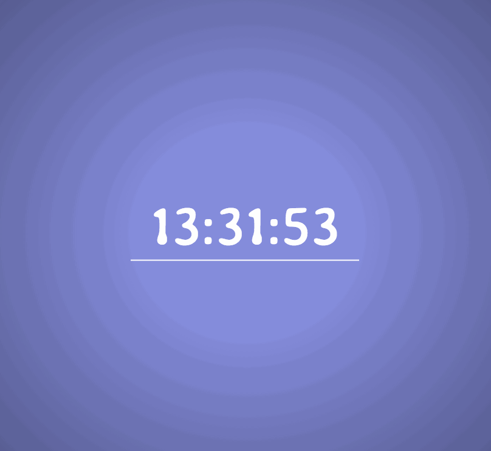

# color-clock

## Objectives

After completing this assignment, you should be able to:

* Demonstrate understanding of functions, loops/array, variadic behavior, `window.setTimeout()` and `window.setInterval()`
* Be able to breakdown a simple process of mathematical steps into a series of statements in JS
* Demonstrate Functional Programming methods
* Demonstrate use of DOM APIs (`document.getElementById()`, `getElementsByClassName()`)
* Demonstrate use of HTMLElement methods and objects (`classList`, `innerHTML`)
* Combine approaches of CSS layout, animation, transitions
* Convert numbers between binary and hex (using `parseInt()` and `Number.toString()`)

### Instructions

```sh
cd <Projects folder>
mkdir <projectname>
cd <projectname>
git init
hub create <projectName>
npm init && bower init
npm install --save broccoli broccoli-sass broccoli-merge-trees
bower install --save reset-css neat
```

Then create your `Brocfile.js`, `public/index.html`, and some folder other than `public` for your Javascript file.

### Deliverables

* A visible build on GH Pages: with a link to the final build in your issue
* A Pull Request link in your issues

### Requirements

* Time should update every second on the clock
* The clock should modify the colors of the background based on the time

* Make it Tick
    * Create and commit a new file in called main.js
    * Created and committed and RAN main.js
    * console.log the current time on page load.
    * console.log the current time every second.
    * Display the current time every second
    * Display the current time, padded with zeros to be exactly two digits long, every second.
    * `console.log` the percentage of a minute that the current seconds represents (e.g., if 30 seconds have elapsed, `console.log` 0.5)
    * Using the percent above, dynamically modify the length of the timer bar.
    * `console.log` a hexidecimal color that is based on the current second every second.
    * Dynamically update the background color of the page using javascript.
      * This can be just a toggle for now

* Hard Mode
    * Show the percentage of a second under the current time
    * Make the time show up in hex every other second instead of human readable: [Check this out](https://developer.mozilla.org/en-US/docs/Web/JavaScript/Reference/Global_Objects/parseInt) `radix` should = 16

## Normal Mode

Recreate this clock driven by CSS and JS:



